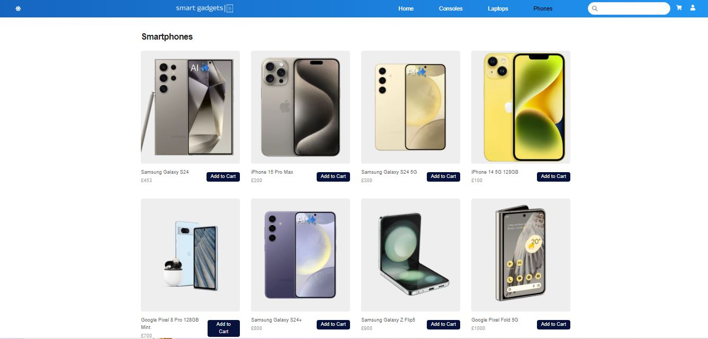

# Smart Gadget App

Empower Your World: Embrace Innovation with Our Latest Smart Gadget App!

## Landing Page

Light Mode

Dark mode

## User Story

- To explore Products: Customers can easily browse Smart Gadgets website finding a wide range of products that suit their preferences and needs.
- For effortless Shopping: Customers can effortlessly add items to their shopping cart and conveniently view the total cost of their order, allowing them to keep track of their purchases before proceeding to checkout.
- Seemless Checkout: Customers can confidently complete their purchases knowing their transactions are safe and secure.
- Registration/Login: Users to be able to easily register and log-in to their accounts.

## Description

Welcome to Smart Gadget App, your go-to ecommerce app for discovering and purchasing the latest gadgets, including smartphones, laptops, gaming consoles, earbuds, and more. With an extensive range of cutting-edge products and a user-friendly platform, Smart Gadget App offers an unparalleled shopping experience for tech enthusiasts and novice alike.

### Features

- <u>Wide Selection</u>: Explore an extensive collection of gadgets from top brands worldwide, conveniently categorized for easy navigation.

- <u>Exclusive Deals</u>: Take advantage of special discounts and limited-time offers to maximize savings on your favorite gadgets.

- <u>Secure Payments</u>: Shop with confidence using our secure payment options, ensuring a safe and hassle-free transaction experience.

- <u>Expert Support</u>: Our dedicated team of tech experts is available to provide personalized assistance and address any queries or concerns you may have.

- <u>Stay Updated</u>: Follow us on social media and subscribe to our newsletter to stay informed about the latest tech trends, product launches, and exclusive promotions.

### Getting Started

To start exploring the world of gadgets with Smart Gadget App, simply sign up for an account or log in if you're already a member. Browse through our catalog, add your favorite items to the cart, and proceed to checkout for a seamless shopping experience.

#### Feedback

We value your feedback! If you have any suggestions, questions, or concerns, please don't hesitate to contact us. Your input helps us continually improve and enhance the Smart Gadget App experience for all users.

#### Stay Connected

Join the Smart Gadget App community on social media to stay connected with fellow tech enthusiasts and receive the latest updates and announcements. Follow us on Twitter, Facebook, and Instagram to be part of the conversation.

Thank you for choosing Smart Gadget App for all your gadget needs. Happy shopping!

### Table of contents

- [Installation](#installation)
- [Usage](#usage)
- [FutureDevelopment](#FutureDevelopment)
- [Resorces](#resorces)
- [Technologies](#technologies)
- [Contributors](#contributors)
- [Lisence](#lisence)
- [Badges](#badges)

## Installation

#### NPM Install

#### Clone repository using SSH:

    - Click on the "Code" button and select "SSH"
    - Copy the SSH URL provided
    - In your terminal, navigate to the directory where you want to clone the repository
    - Run the command: git clone <SSH_URL> : replacing <SSH_URL> with the copied SSH URL.

#### Clone repository using HTTPS:

    - Click on the "Code" button and select "HTTPS"
    - Copy the HTTPS URL provided
    - In your terminal, navigate to the directory where you want to clone the repository
    - Run the command: git clone <HTTPS_URL> : replacing <HTTPS_URL> with the copied HTTPS URL.

## Usage

This webpage can be accessed by [**clicking here**](https://smart-gadget123.netlify.app/)

The page repository [**clicking here**](https://github.com/SKhail/smart-gadget)

## Screenshot of App function

Search result and search history drop down

## Future Development

- For future development, one of our priorities is to implement Google Authentication on the login page. Unfortunately, due to time constraints, we weren't able to accomplish this task during the initial development phase.
- Personalized Recommendations: Implement machine learning algorithms to analyse user behavior and preferences, then provide personalized product recommendations tailored to each user's interests.
  Voice Commerce: Implement voice-enabled shopping capabilities, enabling users to browse and purchase products using voice commands through virtual assistants like Amazon Alexa / Google Assistant.

## Resources

- [**Tailwindcss**](https://tailwindcss.com/)
- [**Material-Tailwind**](https://www.material-tailwind.com/docs/react/carousel#carousel-with-content)
- [**Firebase**](https://console.firebase.google.com/u/2/)
- [**Sanity**](https://www.sanity.io/docs/content-studio/extending?utm_source=readme)
- [**Slick**](https://react-slick.neostack.com/)

## Technologies

- Nodejs
- HTML
- React
- Javascript
- CSS

## Contributors

This app was contribute to by:

Said [**Click here**](https://github.com/SKhail) to view their git hub page

Rahmatullah [**Click here**](https://github.com/RahmatullahZadran) to view their git hub page

Deborah [**Click here**](https://github.com/dalabi91) to view their git hub page

Mohammed [**Click here**](https://github.com/Medj41) to view their git hub page

Nadine [**Click here**](https://github.com/NadineTsianta) to view their git hub page

Rosemary [**Click here**](https://github.com/RoseBenson) to view their git hub page

## License

## Badges

"# SmartGadgets" 
"# SmartGadgets" 
"# SmartGadgets" 
